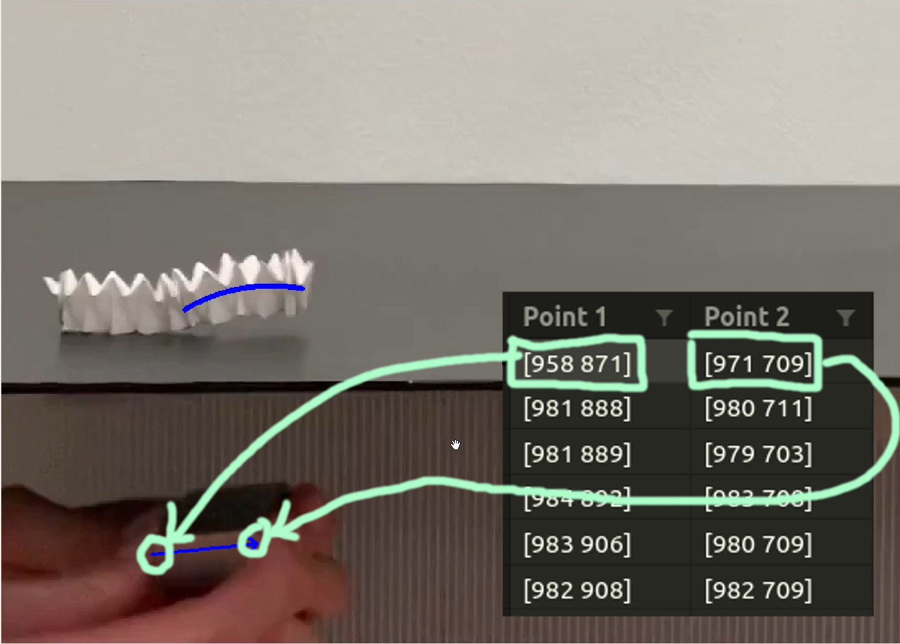
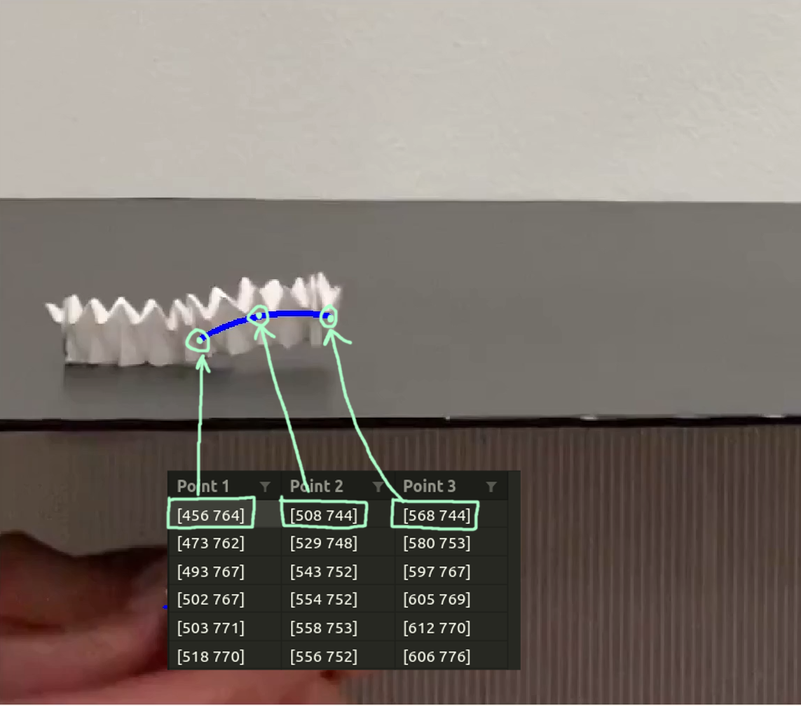

# Origami 2D Tracking

## Video Demo

Various tracking results can be found [here](https://drive.google.com/drive/u/1/folders/1GapJK3oWHEMn0Bm4omrbM7fQUOPg2TjE)

## How to use this repo

### Installing dependencies

- Run the following command to install all dependencies `pip3 install -r requirements.txt`

### Running pre-tracked results on saved videos

- All videos in `clipped_video` directory have pre tracked results.
- All manuallly tracked files are available in `saved_files` directory. `.npy` files contains co-ordinates of tracked files.
- `figure_tracking` directory contains different tracking visualization code for each gait of origami using already saved `.npy` files. To run the file please press spacebar to go to the next frame
- `figure_tracking/matplotlib_saved_files_plot.py` helps in plotting `.npy` using Matplotlib. Can also be used to convert npy file to some other file type like CSV

### How to used saved data

Folder [saved_files](saved_files) contains all CSV files of the tracked results. The results can be found in each dub folder. There are 2 csv files. Lets take example of inchworm motion. There are 2 files named `magnet.csv` and `origami.csv`

1. `magnet.csv`

    - It contains 2 coloum where each coloumn represents points 2D coordnate of *exteme corners of magnet*
    - The entry in every cell represents `[x y]` pixel coordinate.
    - It contains n rows where row number represents the frame/time stamp of coordinate
    

2. `origami.csv`

      - It contains 3 coloum where each coloumn represents points 2D coordnates of origami shape
      - `point 1` amd `point 2` are extremes of origami whereas `point 2` is the point in bween origami`
      - The entry in every cell represents `[x y]` pixel coordinate.
      - It contains n rows where row number represents the frame/time stamp of coordinate
    

### Manual Tracking

1. `frame_by_frame_track.py` 

- The file helps you to track points in frame by frame. 
- The keypoints of the origami/magnet can be manually selected using mouse cursor. 
- Use the slider or 'a' and 'd' keys to parse through the frames. 
- In the event of wrongly selecting some points, choose the new set of points to rewrite them. 
- The chosen points can be viewed by using the slider or 'a' and 'd' keys. 
- The keypoints are saved as a .csv file

### Automatic Tracking

- Fails in high speed motion and
- `multi_object_tracking.py` draw bounding box across 2 points in consecutive frame to start traking and saving into file. It also draws previous points
- `feature_track.py` automatically find top n features to track and tracks the position of each corners
- `optical_flow_tracking.py` Use good features to track points automatically using optical flow algorithm. No manual feature selection in required
- `skeleton_track.py` tracks multiple point and draws a fitted quadratic curve using 3 points

### Visualize tacking

- `visualise_circlefit_manualtrack.py` helps you to visualise the tracked points by fitting a circle
- `visualise_polyfit_manualtrack.py` helps you to visualise the tracked points by fitting a quadratic polynomial
- `trajectory_plotter.py` plots trajectory of magnet as well as origami using matplotlib

## Repository info

- This repo has mutliple algorithm to track the origami
- Algorithms implemented
    1. csrt
    2. kcf
    3. boosting
    4. mil
    5. tld
    6. medianflow
    7. mosse
    8. Optical Flow

## Contributer

- Rohit Lal  [(website)](https://take2rohit.github.io/)
